<h1 align="center">DIGIBADGE</h1>

<h2>Problem Statement</h2>

Digital badges could be motivating to learners and useful to educators by creating a badging system for a youth-focused technology program. It helps educators track their students’ progress. They also equip learners with a tool to acknowledge their accomplishments and show what they are learning. There is great potential for badges to be valuable for industry when it comes to hiring competent employees.A platform that can have digital micro-credentials that validate accomplishment, skill, quality or interest. They can be “packaged” in a digital file, represented by an icon. The file may hold the description of the badge, who issued it and the criteria required to receive it.

<h2>Team Details</h2>

<em><u>TEAM NAME : TEAM DARTH VADER</u></em> 
<b>Team Leader : </b><a href="mailto:ankitkumar.adi13@gmail.com">Ankit Kumar</a>  
<b>Member 2 : </b><a href="mailto:prasad.ashish162@gmail.com">Ashish Prasad</a>  
<b>Member 3 : </b><a href="mailto:singh.divyansh1802@gmail.com">Divyansh Singh</a>  

<h2>Project Details</h2>

This project uses three technologies/languages.  
- PHP (For Backend)  
- Javascript (To create a test system)  
- HTML & CSS (To create and style webpages)  

<h2>Setup</h2>

- Fork the repo.  
- Clone the repo.  
- Open <em>index.html</em> file in any browser.  
- You are good to go. Go and play with this website and have fun.  

<h2>Snapshots</h2>

<h3>Home Page</h3>

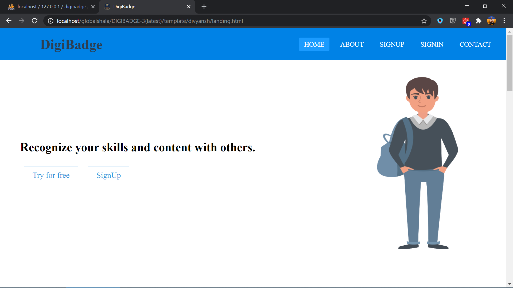
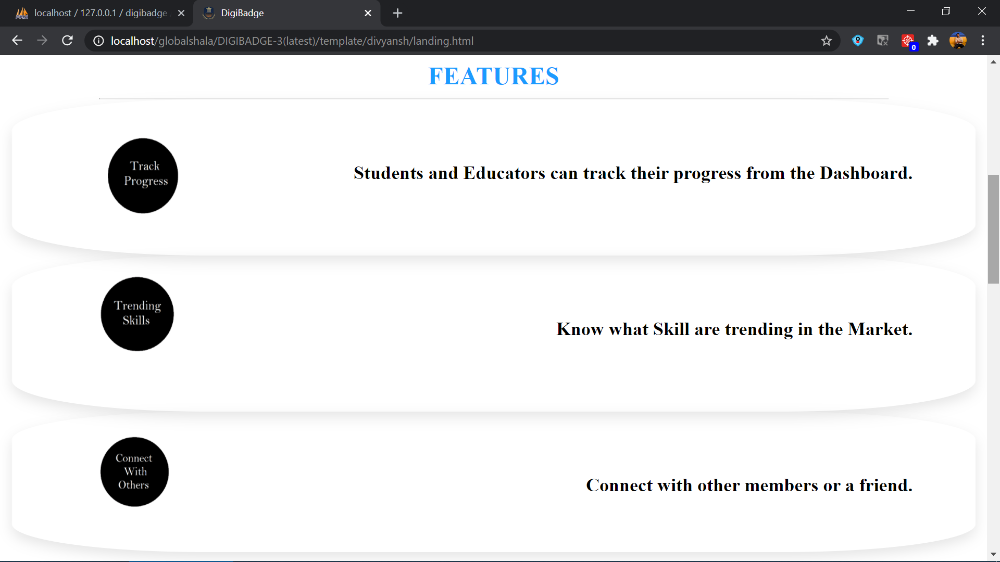
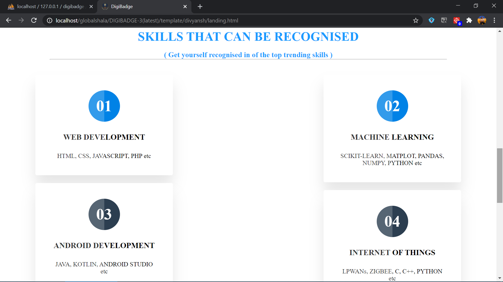
<h3>Register Page</h3>

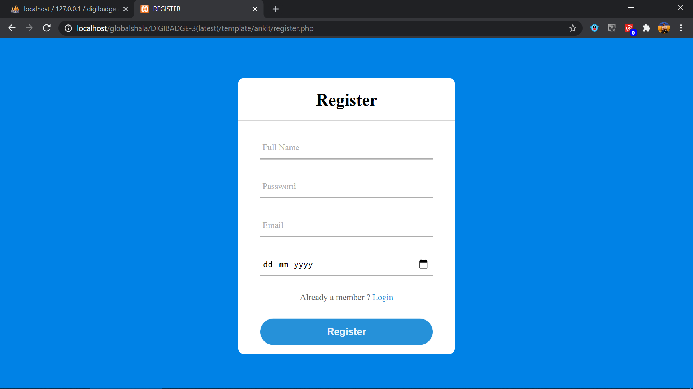
<h3>Login Page</h3>

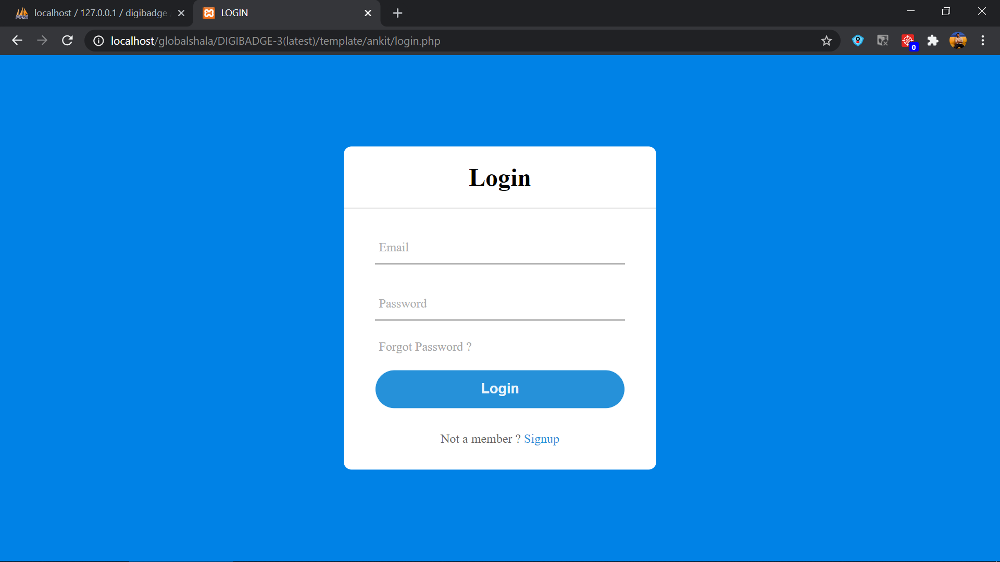
<h3>User Profile Page</h3>

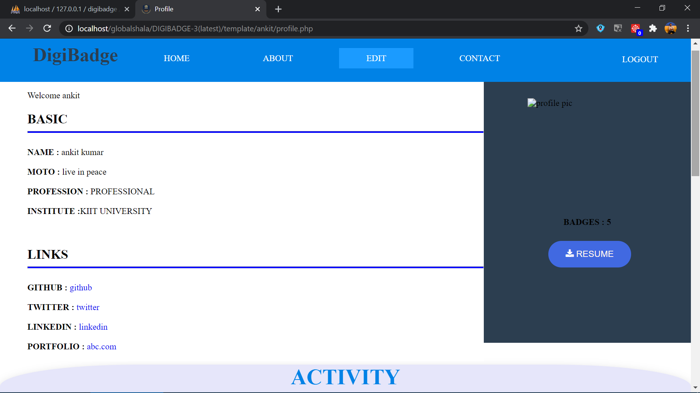
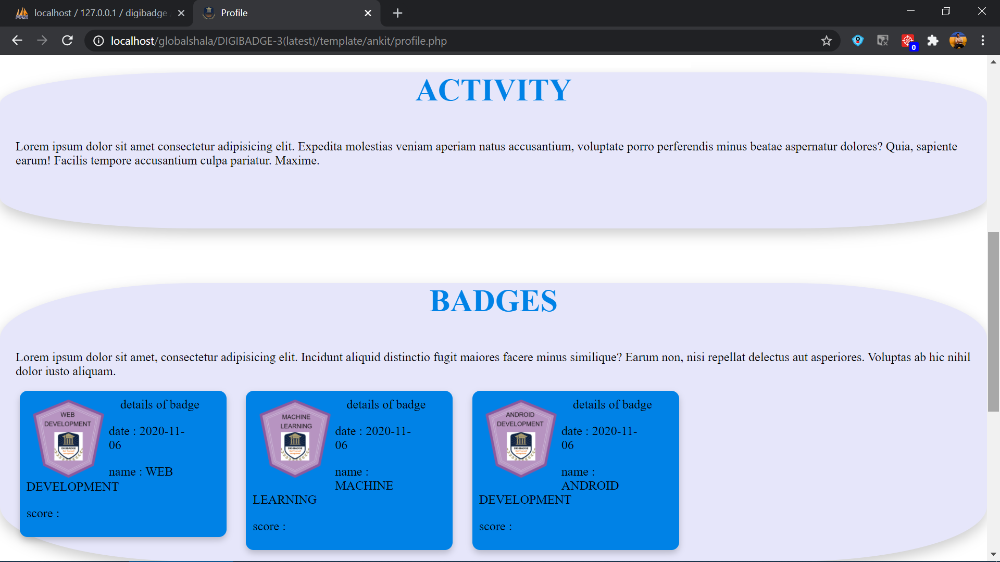
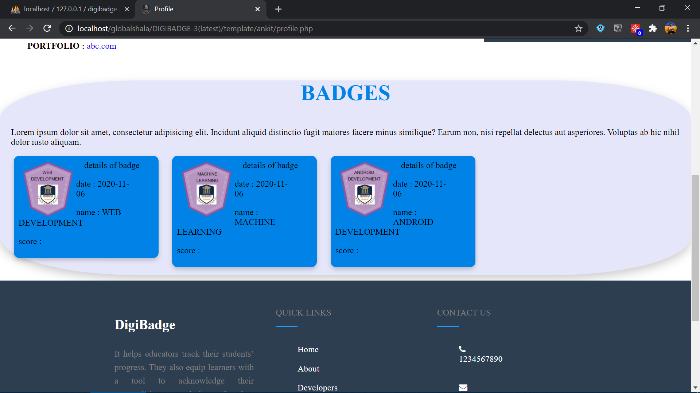
<h3>Test Portal Page</h3>

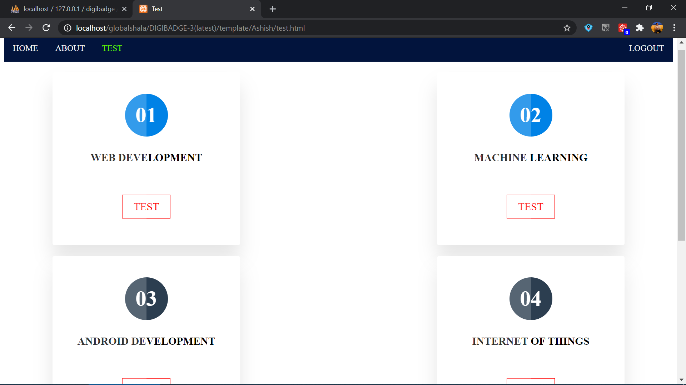
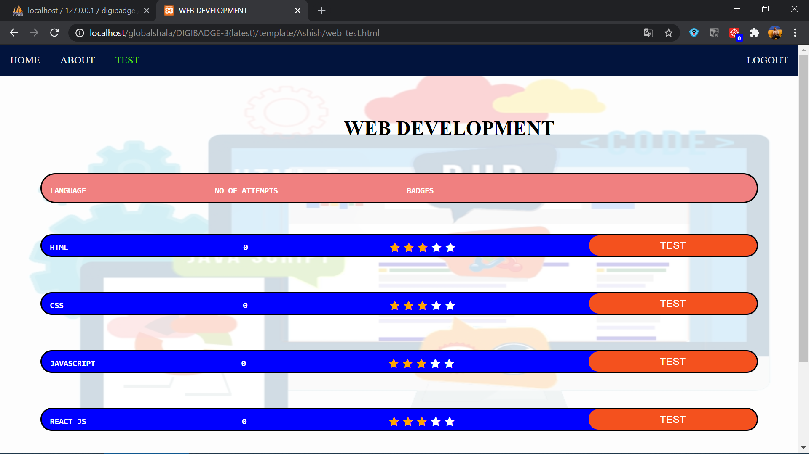
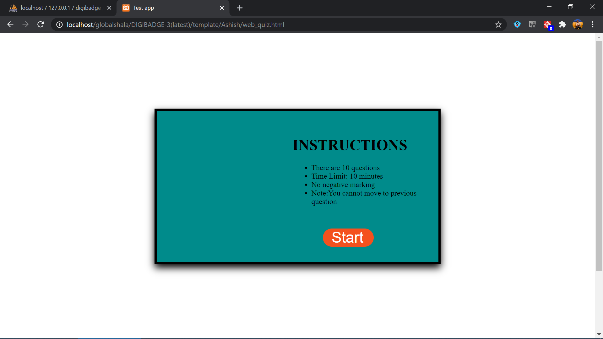
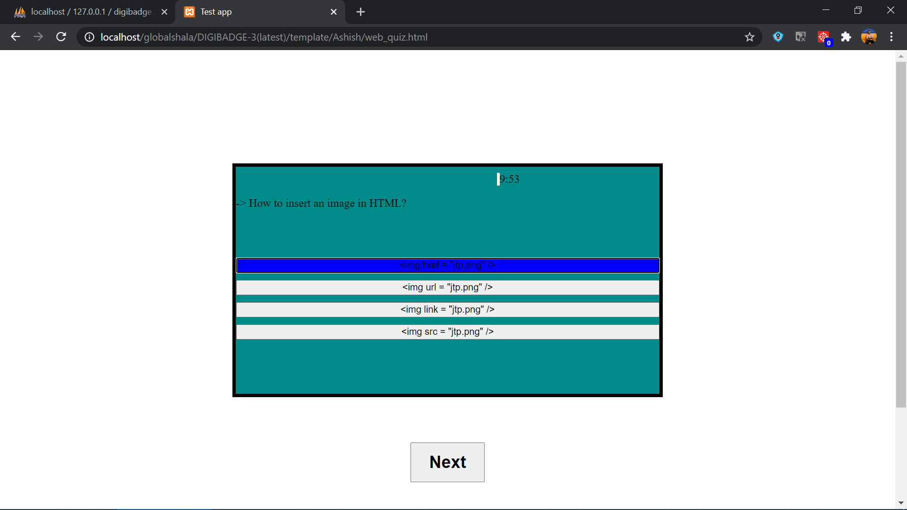
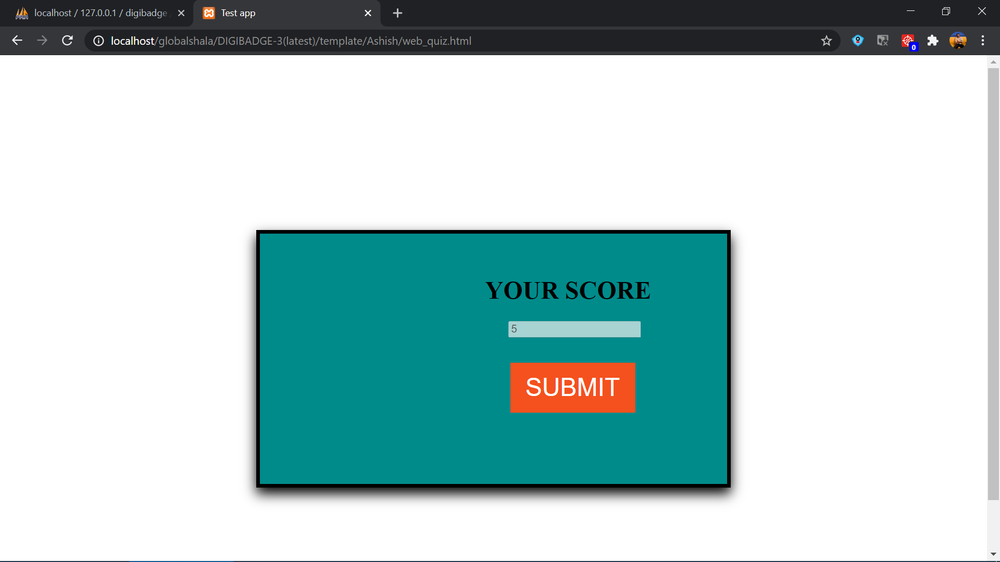
